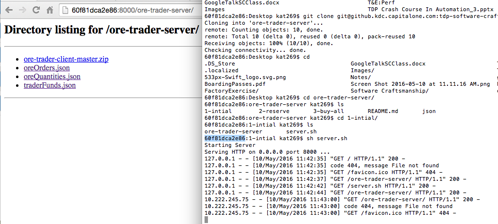

# Ore Trader Server


## Running the Server

The folder are numbered by the stages they are introduced in. 

* 1-intial
* 2-reserve
* 3-buy-all

To start the server, navigate into the current stage’s folder and run the server.sh script.

```
sh server.sh
```

To find your ip address navigate to ```http://{your computers name}:8000/``` in your favorite browser. The ip address will be listed on the left in the console output.

Example:

